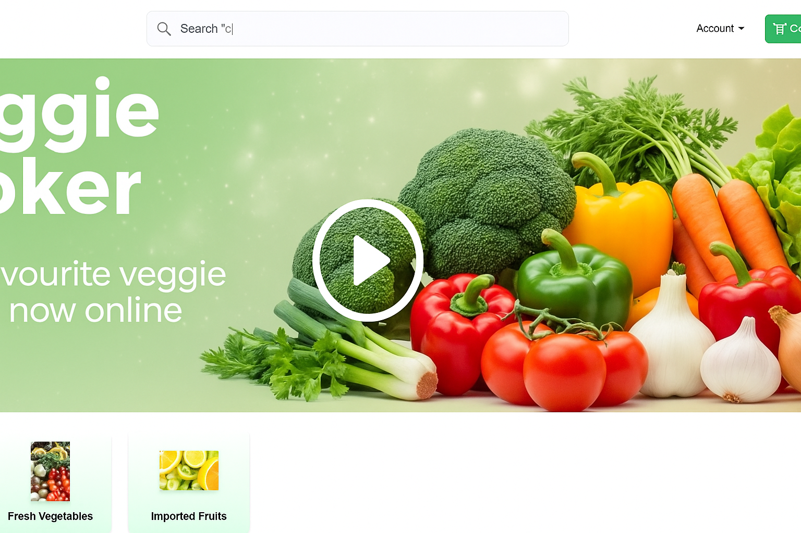

# 🥦 Veggie Stoker

**Veggie Stoker** is your trusted partner for fresh, quality vegetables and groceries. Built using the **MERN stack (MongoDB, Express.js, React.js, Node.js)**, this full-stack platform brings farm-fresh produce directly to your doorstep with real-time inventory tracking, customer order management, and efficient delivery.

## 🚀 Live Project
👉 [https://www.veggiestoker.com/](https://www.veggiestoker.com/)

## 🎥 Project Demo Video

⚠️ Note: This repository contains a prototype version of the application. For access to the latest production-ready version or for collaboration opportunities, please feel free to connect with me directly at +91-7056099684 or mail at : sahilbharal0001@gmail.com

## 🌱 Our Story

Founded in 2020, Veggie Stoker began as a small local initiative to make fresh produce more accessible and affordable. Today, it's a trusted platform serving thousands of happy customers, thanks to strong partnerships with local farmers and a passion for technology-driven solutions.

---

## 🚀 Features

- 📦 **Real-Time Inventory Management**  
  Monitor and update stock levels dynamically for each product.

- 🛒 **Customer Order System**  
  Add, manage, and track customer orders with delivery time slots.

- 🧾 **Admin Dashboard**  
  Manage products, orders, customers, and delivery efficiently.

- 💸 **Secure Payment Integration**  
  Offers smooth and secure checkout with integrated payment gateways.

- 🔔 **Notification & Support**  
  24/7 support system and real-time order updates.

- ⏱️ **Fast Delivery**  
  Guaranteed delivery within 24 hours, optimized by smart logistics.

---

## 💡 Why Veggie Stoker?

- **100% Freshness Guarantee**
- **Direct from Local Farmers**
- **Competitive Pricing (No Middlemen)**
- **Secure Payments & Easy Returns**
- **24/7 Customer Support**

---

## 🧑‍💻 Meet the Co-Founders

### 👨‍💻 Sahil Bharal  
**Co-Founder & Full Stack Developer**  
📞 +91 7056099684  
- React.js & Node.js Expert  
- MongoDB & Express.js Developer  
- UI/UX Design Enthusiast  
- Passionate about E-commerce  

> “I created Veggie Stoker to bridge the gap between local farmers and urban consumers using modern web technology.”

---

## 🛠️ Tech Stack

- **Frontend**: React.js, Tailwind CSS  
- **Backend**: Node.js, Express.js  
- **Database**: MongoDB  
- **Payment**: Integrated Payment Gateway (Razorpay)  

---

📞 For the latest version or full-fledged deployment, reach out at: +91-7056099684 or mail at : sahilbharal0001@gmail.com
